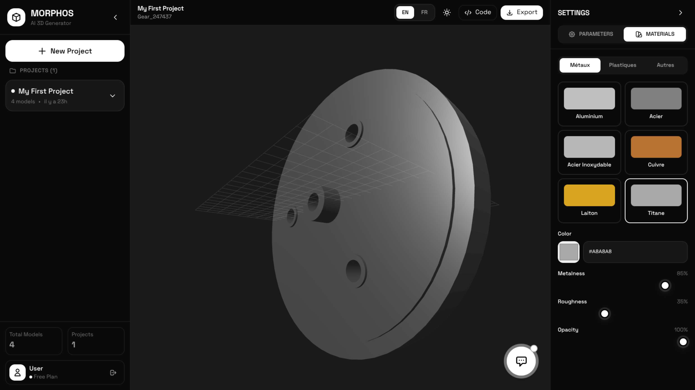

<div align="center">

# MORPHOS

### Parametric 3D Parts Generator

**AI-powered CAD modeling with natural language**

[](https://reactjs.org/)
[](https://www.typescriptlang.org/)
[](https://threejs.org/)
[](https://vitejs.dev/)
[](LICENSE)

[**🚀 Live Demo**](https://morphos.pages.dev)

*Last updated: February 8, 2026*

</div>

---



## Overview

MORPHOS is a web-based parametric 3D modeling application that uses Google's Gemini AI to generate JSCAD code from natural language descriptions. Create complex 3D models simply by describing what you want.

---

## Features

| Feature | Description |
|---------|-------------|
| **AI Generation** | Generate 3D models using natural language (French/English) |
| **Real-time Preview** | Interactive 3D viewport with Three.js rendering |
| **Parametric Editing** | Adjust model parameters with sliders and controls |
| **Material Library** | PBR materials (metals, plastics, glass, wood) |
| **Multi-format Export** | STL, OBJ, 3MF, G-code for 3D printing |
| **Theme Support** | Dark and Light mode |
| **PWA Ready** | Installable as a progressive web app |

---

## Quick Start

```bash
# Clone the repository
git clone https://github.com/alainpaluku/morphos.git
cd morphos

# Install dependencies
npm install

# Start development server
npm run dev
```

Open http://localhost:5174 in your browser.

---

## Configuration

Create a `.env` file in the root directory:

```env
# Gemini API Configuration
VITE_GEMINI_API_KEY=your_gemini_api_key

# Optional: Specify Gemini model (default: gemini-2.5-flash)
# FREE MODELS (February 2026):
# - gemini-3-flash (Latest, best speed/quality balance)
# - gemini-2.5-pro (Complex reasoning)
# - gemini-2.5-flash (Recommended for CAD - DEFAULT)
# - gemini-2.5-flash-lite (High throughput, cost-effective)
# - gemini-2.0-flash (Multimodal, agents)
# - gemini-1.5-flash (Stable, proven)
# - gemini-1.5-flash-8b (Lightweight)
VITE_GEMINI_MODEL=gemini-2.5-flash
```

Get your API key from [Google AI Studio](https://makersuite.google.com/app/apikey).

**Model Selection (All FREE):**
- `gemini-3-flash`: Latest model, best speed/quality balance ⚡⭐⭐⭐⭐
- `gemini-2.5-flash`: **Recommended for CAD generation** (default) ⚡⚡⭐⭐⭐⭐
- `gemini-2.5-pro`: Maximum quality for complex models 🐢⭐⭐⭐⭐⭐
- `gemini-2.5-flash-lite`: High throughput, cost-effective ⚡⚡⚡⭐⭐⭐
- `gemini-2.0-flash`: Great for multimodal and agents ⚡⚡⭐⭐⭐⭐
- `gemini-1.5-flash`: Stable and proven ⚡⚡⭐⭐⭐

**Note:** Gemini 3 Pro is NOT available in the free tier.

---

## Tech Stack

| Category | Technology |
|----------|------------|
| Frontend | React 18, TypeScript 5 |
| 3D Engine | Three.js |
| CAD Library | @jscad/modeling |
| AI | Google Gemini API |
| Build Tool | Vite |
| Styling | Tailwind CSS |
| Deployment | Cloudflare Pages |

---

## Project Structure

```
src/
├── components/     # React components
│   ├── layout/     # Layout components (Sidebar, Header, etc.)
│   ├── modals/     # Modal dialogs
│   └── ui/         # Reusable UI components
├── services/       # Business logic services
│   ├── CADService.ts       # AI code generation
│   ├── ExportService.ts    # File export handling
│   └── MaterialService.ts  # Material management
├── workers/        # Web Workers
│   └── jscad.worker.ts     # JSCAD code execution
├── utils/          # Utility functions
├── contexts/       # React contexts
├── constants/      # App constants
└── types/          # TypeScript types
```

---

## Usage

1. **Open the application** at http://localhost:5174
2. **Click the AI Assistant** button (bottom of screen)
3. **Describe your model** in natural language
   - Example: "Create a gear with 20 teeth"
   - Example: "Make a box with rounded corners"
4. **Adjust parameters** using the right panel sliders
5. **Change materials** in the Materials tab
6. **Export your model** in your preferred format

---

## Deployment

### Cloudflare Pages

```bash
# Build the project
npm run build

# Deploy to Cloudflare
npx wrangler pages deploy ./dist --project-name=morphos
```

Or connect your GitHub repository directly in the [Cloudflare Dashboard](https://dash.cloudflare.com/).

**Build settings:**
- Build command: `npm run build`
- Build output: `dist`
- Environment variable: `VITE_GEMINI_API_KEY`

---

## Contributing

Contributions are welcome! Please feel free to submit a Pull Request.

---

## License

This project is **proprietary software**. All rights reserved.

**You may NOT use, copy, modify, or distribute this code without explicit written permission from the author.**

To request permission, please contact:
- GitHub: [@alainpaluku](https://github.com/alainpaluku)

See the [LICENSE](LICENSE) file for full terms.

---

<div align="center">

**Built with [Three.js](https://threejs.org/) and powered by [Google Gemini](https://ai.google.dev/)**

</div>
