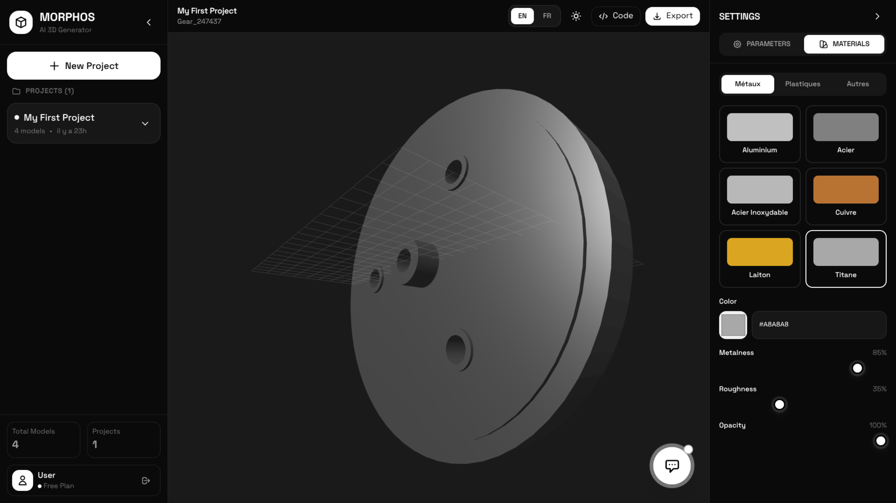

<div align="center">

# MORPHOS

### AI-Powered Parametric 2D & 3D CAD Generator

**Transform natural language and images into professional 2D & 3D CAD models**

[](https://reactjs.org/)
[](https://www.typescriptlang.org/)
[](https://threejs.org/)
[](https://vitejs.dev/)
[](LICENSE)

[**Live Demo**](https://morphos.pages.dev)

*Last updated: February 8, 2026*

</div>

---



## Overview

**MORPHOS** is a cutting-edge, web-based **AI CAD generator** designed for engineers, makers, and product designers. By leveraging the power of **Google Gemini AI**, MORPHOS converts natural language descriptions and hand-drawn sketches into high-fidelity, **parametric 2D and 3D models**.

Whether you need a complex 3D part for printing or a precise 2D drawing for CNC machining, MORPHOS provides an intuitive interface to bridge the gap between imagination and manufacturing.

---

## Key Features

- 🤖 **AI-Driven Modeling**: Generate professional CAD code using natural language prompts in French or English.
- 🖼️ **Image-to-CAD**: Advanced computer vision integration to transform sketches and photos into editable CAD models.
- 📐 **Parametric 2D & 3D**: Full support for parametric design using **Replicad** (3D) and **Makerjs** (2D).
- 👁️ **Live Interactive Preview**: Real-time rendering with **Three.js** and dedicated 2D SVG overlays.
- ⚙️ **CNC & 3D Print Ready**: Export your designs in industry-standard formats like **STEP, STL, OBJ, DXF, and SVG**.
- 🛠️ **Visual Parameter Tuning**: Fine-tune your models with dynamic sliders and real-time updates.
- 🎨 **Material Simulation**: High-quality PBR material previews (Steel, Aluminum, Carbon Fiber, Wood, etc.).

---

## Features

| Feature | Description |
|---------|-------------|
| **AI Generation** | Generate 3D (Replicad) and 2D (Makerjs) models using natural language (French/English) |
| **Image-to-CAD** | Upload an image or sketch to guide the AI generation |
| **Real-time Preview** | Interactive 3D viewport with Three.js rendering and 2D overlay |
| **Parametric Editing** | Adjust model parameters with sliders and controls |
| **CNC Ready Export** | STEP, STL, OBJ for 3D; SVG, DXF for 2D CNC/Laser cutting |
| **Theme Support** | Dark and Light mode |

---

## Quick Start

```bash
# Clone the repository
git clone https://github.com/alainpaluku/morphos.git
cd morphos

# Install dependencies
npm install

# Start development server
npm run dev
```

Open http://localhost:5174 in your browser.

---

## Configuration

To use the AI generation features, you need a Google Gemini API key.

1. **Get your API key** from [Google AI Studio](https://aistudio.google.com/app/apikey).
2. **Local Development**: Create a `.env` file in the root directory:
   ```env
   VITE_GEMINI_API_KEY=your_gemini_api_key
   ```
3. **Cloudflare Deployment**: Add `VITE_GEMINI_API_KEY` to your environment variables in the Cloudflare Pages dashboard.

**Model Used:** Gemini 2.5 Flash (free, high performance)

---

## Tech Stack

| Category | Technology |
|----------|------------|
| Frontend | React 18, TypeScript 5 |
| 3D Engine | Three.js |
| CAD Engine (3D) | Replicad (@replicad/core) - OpenCascade WASM |
| CAD Engine (2D) | Makerjs - Vector drawings for CNC |
| AI | Google Gemini API |
| Build Tool | Vite |
| Styling | Tailwind CSS |
| Deployment | Cloudflare Pages |

---

## Project Structure

```
src/
├── components/     # React components
│   ├── layout/     # Layout components (Sidebar, Header, etc.)
│   ├── modals/     # Modal dialogs
│   └── ui/         # Reusable UI components
├── services/       # Business logic services
│   ├── CADService.ts       # AI code generation
│   ├── ExportService.ts    # File export handling
│   └── MaterialService.ts  # Material management
├── workers/        # Web Workers
│   └── cad.worker.ts       # Replicad & Makerjs execution (WASM)
├── utils/          # Utility functions
├── contexts/       # React contexts
├── constants/      # App constants
└── types/          # TypeScript types
```

---

## Usage

1. **Open the application** at http://localhost:5174
2. **Click the AI Assistant** button (bottom of screen)
3. **Describe your model** in natural language
   - Example: "Create a gear with 20 teeth"
   - Example: "Make a box with rounded corners"
4. **Adjust parameters** using the right panel sliders
5. **Change materials** in the Materials tab
6. **Export your model** in your preferred format

---

## Deployment

### Cloudflare Pages

**Option 1: Via GitHub (Recommended)**

1. Connect your repository on [Cloudflare Dashboard](https://dash.cloudflare.com/)
2. Configure build settings:
   - Build command: `npm run build`
   - Build output: `dist`
   - Environment variables:
     - `VITE_GEMINI_API_KEY`: Your API key
     - `VITE_GEMINI_MODEL`: `gemini-2.5-flash` (optional)

**Option 2: Via CLI**

```bash
# Build the project
npm run build

# Deploy to Cloudflare Pages
npx wrangler pages deploy ./dist --project-name=morphos
```

---

## Contributing

Contributions are welcome! Please feel free to submit a Pull Request.

---

## License

This project is **proprietary software**. All rights reserved.

**You may NOT use, copy, modify, or distribute this code without explicit written permission from the author.**

To request permission, please contact:
- GitHub: [@alainpaluku](https://github.com/alainpaluku)

See the [LICENSE](LICENSE) file for full terms.

---

<div align="center">

**Built with [Three.js](https://threejs.org/) and powered by [Google Gemini](https://ai.google.dev/)**

</div>
